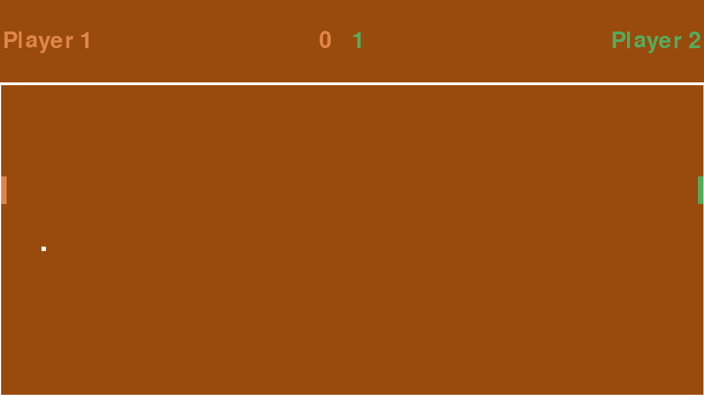

# Pong Olympics


Pong Olympics is a Python-based spinoff of [Video Olympics](https://en.wikipedia.org/wiki/Video_Olympics) on the Atari 2600, with unique features and gameplay, powered by the Pygame game engine.



Give it a try by clicking [here](https://pacna.github.io/pong-olympics/).

## Ubuntu Prerequisites

Before running Pong Olympics, ensure you have the following installed on your system:

1. [Python](https://www.python.org/downloads/) (python 3.12)
2. [Make](https://www.gnu.org/software/make/)

## Installation

To install Pong Olympics and its dependencies, run the following command:

```bash
$ make install
```

## Running the game

To start playing Pong Olympics, run the following command:

```bash
$ make run
```

## Instructions and Rules

By default, the player uses the `WASD` keys to move the paddle. You can switch to using the `Arrow Keys` by setting the `type` to `2` in the `config.json` file. You can also change your name on the screen by updating the `name` field.

Types:

1. Self type or 1 - use the `WASD Keys` and play on the left-hand side of the screen.
2. Opponent type or 2 - use the `Arrow keys` and play on the right-hand side of the screen.

### Shortcuts and bindings

<kbd>Esc</kbd> -- Exit the game

**Note:** The game has no win condition, so just have fun!

## Running Tests

To run the test suite for Pong Olympics, use the following command:

```bash
$ make test
```

## Troubleshooting

If you encounter an error message about the Tkinter module not being found, you may need to install it using the following command:

```bash
$ apt-get install python3-tk
```

**Note:** Pong Olympics is still a work in progress and currently only has one level.
